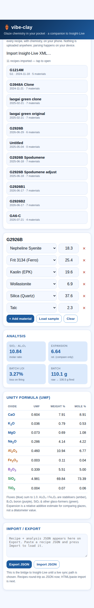

# vibe-clay 🏺

Phone-friendly glaze tools for a hobbyist potter — a companion to
[Insight-Live](https://insight-live.com), hosted on GitHub Pages, no backend
required.

Insight-Live is a great but Web-1.0 desktop-oriented service. `vibe-clay` slowly
ports its genuinely useful, offline-computable tools to something Alex can use
from his phone, and lays the groundwork to sync with his real account if/when a
data path opens up.



## What works today

- **Glaze chemistry engine** (`js/chemistry.js`) — from a recipe (materials +
  batch grams) it computes:
  - **UMF / Seger** unity formula (fluxes normalised to 1.0)
  - oxide **weight-%** and **mole-%**
  - **SiO₂:Al₂O₃** ratio
  - a relative **thermal-expansion** estimate (for comparing glazes)
  - **LOI** and **batch cost**
- **Mobile-first UI** (`index.html`) — recipe builder + live analysis, blue
  theme, dark-mode aware, works offline once loaded.
- **Materials database** (`data/materials.json`) — ~30 common ceramic materials
  with nominal Digitalfire-style oxide analyses. Extensible.
- **Insight-Live import** — export your recipe library from Insight-Live (XML)
  and open it here: every recipe, with chemistry, on your phone. Material names
  are resolved via an alias system (`Ferro Frit 3134` → `Frit 3134`, `EP Kaolin`
  → `Kaolin (EPK)`, …). Parsing is 100% on-device; nothing is uploaded. Verified
  against a real 11-recipe export. Recipes also round-trip as JSON.
- **Claude skill** (`skills/insight-live-navigator/`) — so Claude can navigate
  Insight-Live/Digitalfire and this app effectively.

## The three parts of this project

1. **Skills** for Claude — `skills/insight-live-navigator/`.
2. **JS frontend** Alex uses from his phone — this repo, deployable to Pages.
3. **Materials-science calculations** — `js/chemistry.js`, since no backend/API
   is available (see below).

## Status of Insight-Live sync

Short version: **not possible today with a pure GitHub Pages site.** Insight-Live
has no open public API yet, uses cookie/session login, and CORS blocks a static
browser app from calling it. Full analysis and the options (official API,
serverless proxy, manual import/export) are in
[`docs/api-integration-plan.md`](docs/api-integration-plan.md).

## Run locally

```bash
python3 -m http.server 8099
# open http://localhost:8099
```

No build step, no dependencies — plain ES modules.

## Deploy

Pushed to `main`, the workflow in `.github/workflows/pages.yml` publishes the
repo root to GitHub Pages. (Enable Pages → "GitHub Actions" in repo settings.)

## Roadmap

- [x] Recipe import (Insight-Live XML export → data model)
- [ ] Firing-schedule editor + graph
- [ ] More materials + pull real analyses from Digitalfire (tighten nominal values)
- [ ] Sync adapter once a data path (official API / proxy) is chosen
- [ ] Glaze limit/typical-range warnings (crazing, durability)
