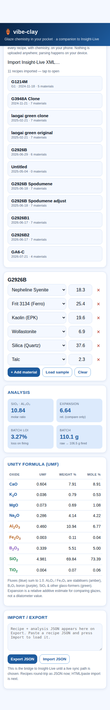

# vibe-clay 🏺

**v1.0.0** · Phone-friendly glaze tools for a hobbyist potter — a companion to
[Insight-Live](https://insight-live.com), hosted on GitHub Pages, no backend
required.

Insight-Live is a great but Web-1.0 desktop-oriented service. `vibe-clay` slowly
ports its genuinely useful, offline-computable tools to something Alex can use
from his phone, and lays the groundwork to sync with his real account if/when a
data path opens up.



## What works today

- **Glaze chemistry engine** (`js/chemistry.js`) — from a recipe (materials +
  batch grams) it computes, matching what Insight-Live shows:
  - **UMF / Seger** unity formula (fluxes normalised to 1.0)
  - oxide **weight-%** and **mole-%**, with SiO₂/Al₂O₃/B₂O₃ highlighted
  - ratios: **SiO₂:Al₂O₃**, **SiB:Al** ((SiO₂+B₂O₃):Al₂O₃), **R₂O:RO**
    (alkali:alkaline-earth), and the combined **KNaO** line
  - a relative **thermal-expansion** estimate (for comparing glazes)
  - **LOI** and **batch cost**
  - **base recipe vs additions** (colorants on top), with separate totals —
    the way potters actually mix from materials on hand
  - Validated against real Insight-Live output: G2926B Spodumene matches its
    UMF, KNaO (0.27), and R₂O:RO (0.4:0.6) essentially exactly.
- **Line blend** (`js/chemistry.js` `lineBlend()`) — blend two glazes into `n`
  evenly spaced points from 100% A → 100% B and get the full UMF + analysis at
  every point. Each recipe is normalised to a common base first, so the blend
  mixes equal *proportions* of glaze (the way a potter mixes from two buckets),
  and materials in only one recipe scale from/to zero across the line. In the app
  it's a scrollable matrix (oxide UMF + Si:Al, R₂O:RO, expansion, LOI per point)
  with a **Load** button that drops any point into the recipe builder; on the CLI
  it's `--blend N`.
- **Mobile-first UI** (`index.html`) — recipe builder + live analysis, blue
  theme, dark-mode aware, works offline once loaded.
- **Materials database** (`data/materials.json`) — ~30 common ceramic materials
  with nominal Digitalfire-style oxide analyses. Extensible.
- **Insight-Live import** — export your recipe library from Insight-Live (XML)
  and open it here: every recipe, with chemistry, on your phone. Material names
  are resolved via an alias system (`Ferro Frit 3134` → `Frit 3134`, `EP Kaolin`
  → `Kaolin (EPK)`, …). Parsing is 100% on-device; nothing is uploaded. Verified
  against a real 11-recipe export. Recipes also round-trip as JSON.
- **Claude skills** (`skills/`) — so Claude can help effectively:
  - `insight-live-navigator` — navigating Insight-Live/Digitalfire, the XML
    schema and data model.
  - `glaze-qa` — answering glaze-chemistry questions with **computed** numbers
    and limit-range flags (crazing, durability, reduction vs oxidation).
  - `draft-recipe` — building/adjusting a recipe and emitting copy-paste
    Insight-Live XML.
  - `make-issue` — interviewing a lay user to file a good GitHub issue.
  - `vibe-clay` — the packaged version of the three glaze skills, bundled with
    the engine so it works in a **regular Claude chat** (see below).
- **Analyzer CLI** (`tools/analyze.mjs`) — run the chemistry engine from the
  terminal on an Insight-Live XML export or app JSON, with `--target` limit
  flagging and `--xml` round-trip export.

## The three parts of this project

1. **Skills** for Claude — `skills/` (navigator, glaze-qa, draft-recipe, make-issue).
2. **JS frontend** Alex uses from his phone — this repo, deployable to Pages.
3. **Materials-science calculations** — `js/chemistry.js` (+ `tools/analyze.mjs`,
   `data/glaze-limits.json`), since no backend/API is available (see below).

## Status of Insight-Live sync

Short version: **not possible today with a pure GitHub Pages site.** Insight-Live
has no open public API yet, uses cookie/session login, and CORS blocks a static
browser app from calling it. Full analysis and the options (official API,
serverless proxy, manual import/export) are in
[`docs/api-integration-plan.md`](docs/api-integration-plan.md).

## Run locally

```bash
python3 -m http.server 8099
# open http://localhost:8099
```

No build step, no dependencies — plain ES modules.

Analyse a recipe from the terminal:

```bash
node tools/analyze.mjs path/to/InsightRecipeLibrary.xml --target cone6-glossy
echo '{"lines":[{"material":"EPK","amount":20},{"material":"Silica","amount":30}]}' | node tools/analyze.mjs
```

Line-blend two glazes into `N` points, each with its UMF + analysis:

```bash
node tools/analyze.mjs glossy.json matte.json --blend 5
node tools/analyze.mjs library.xml --blend 5   # blends the first two recipes
```

## Use it in a regular Claude chat

The glaze skills plus the chemistry engine package into a single skill zip, so
Claude can compute real UMF numbers in an ordinary chat — no repo, no terminal.

**Get the zip from the [latest release](https://github.com/RolynTrotter/vibe-clay/releases/latest)**
(`vibe-clay-<version>.zip`), or build it yourself:

```bash
npm run build:skill      # → dist/vibe-clay-1.0.0.zip
npm run test:skill       # zip shape + frontmatter + engine, from an unzipped copy
```

> **Not** the green *Code → Download ZIP* button — that's the source tree, which
> has five `SKILL.md` files in it and the uploader rejects it.

Upload the zip in claude.ai under Settings → Features → Skills (needs code
execution enabled), then just ask a glaze question: "here's my cone 6 clear, why
is it crazing?" The skill loads itself when the conversation is about glazes.

What's in the zip:

```
vibe-clay/
├── SKILL.md              entry point: how to run the engine, what it returns
├── tools/analyze.mjs     the CLI
├── js/, data/            engine + materials & limit ranges
└── references/           glaze-qa · draft-recipe · insight-live-navigator
```

The bundle keeps the repo's layout, so every command in `SKILL.md` is the same
command that works in a clone — nothing is rewritten at build time except the
reference cross-links. It needs Node 18+ in the chat's code sandbox and no
network. `make-issue` is deliberately left out: it needs GitHub tooling, so it
stays a repo-only skill for Claude Code.

## Versioning

One version number covers the app, the engine, and the skill.
`package.json` is the source of truth; `skills/vibe-clay/SKILL.md`
(`metadata.version`), the app footer in `index.html`, and `CHANGELOG.md` carry a
copy. `npm run check:version` fails if they drift, and `build:skill` runs the
same check before packaging.

To cut a release: bump those four, note the changes in `CHANGELOG.md`, merge,
then tag `main`:

```bash
git tag v1.0.0 && git push origin v1.0.0
```

`.github/workflows/skill.yml` builds the zip, runs the checks, refuses a tag
that doesn't match `package.json`, and attaches `vibe-clay-<version>.zip` to a
GitHub Release. The same workflow builds and tests on every push and PR, with
the zip kept as a build artifact — so an untagged `main` still has a downloadable
zip, it just isn't a release.

## Deploy

Pushed to `main`, the workflow in `.github/workflows/pages.yml` publishes the
repo root to GitHub Pages. (Enable Pages → "GitHub Actions" in repo settings.)

## Roadmap

- [x] Recipe import (Insight-Live XML export → data model)
- [x] Line-blend tool (two glazes → N points, UMF + analysis each)
- [ ] Firing-schedule editor + graph
- [ ] More materials + pull real analyses from Digitalfire (tighten nominal values)
- [ ] Sync adapter once a data path (official API / proxy) is chosen
- [ ] Glaze limit/typical-range warnings (crazing, durability)
